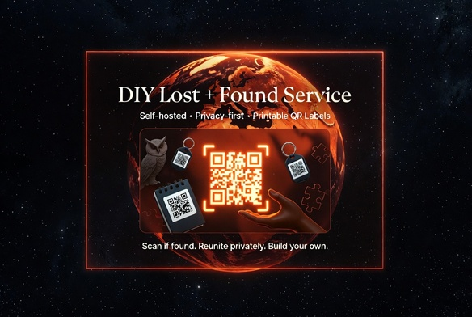
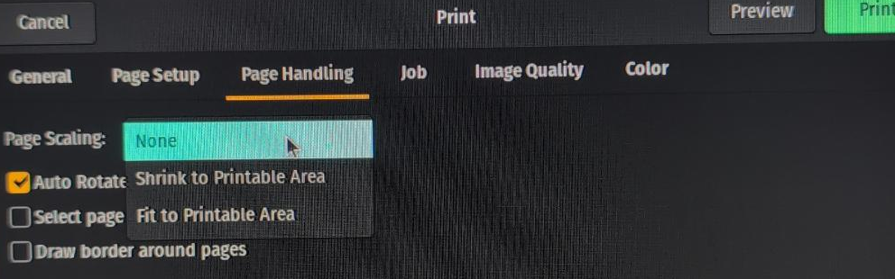
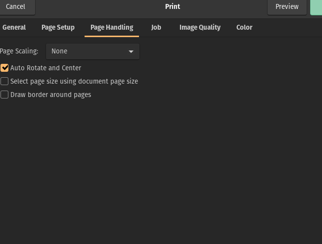

# DIY Lost-and-Found Service



[](https://github.com/nottoseethesun/diy-lost-and-found-service/actions/workflows/tests.yml)
[](https://github.com/nottoseethesun/diy-lost-and-found-service/actions/workflows/security.yml)
[](https://github.com/nottoseethesun/diy-lost-and-found-service/actions/workflows/markdown-lint.yml)

A self-hosted lost-and-found system built around printed **QR-code labels**.
Stick a label on a thing you'd hate to lose; if someone finds it and scans the
code, they land on a private contact page telling them how to reach you — **without
any of your personal details being printed on the label itself.** You mint the
codes, print them onto peel-and-stick Avery film, and host a tiny page that
answers the scans.

## Table of Contents

- [Why Provide Your Own Lost+Found Service?](#why-provide-your-own-lostfound-service)
- [How It Works](#how-it-works)
- [Repository Layout](#repository-layout)
- [Install](#install)
  - [Prerequisites](#prerequisites)
  - [Clone](#clone)
  - [Install the Label-Generation Dependencies](#install-the-label-generation-dependencies)
- [Configure](#configure)
  - [Create Your Local Data Files](#create-your-local-data-files)
  - [Project Settings](#project-settings)
- [Usage](#usage)
  - [Run](#run)
    - [Mint Your Slugs](#mint-your-slugs)
    - [Generate Labels](#generate-labels)
    - [Print — Set Page Scaling to "None" (Required)](#print--set-page-scaling-to-none-required)
  - [Apply & Verify](#apply--verify)
- [Development](#development)
  - [Test](#test)
    - [Over-the-Wire Smoke Test](#over-the-wire-smoke-test)
  - [Lint the Markdown](#lint-the-markdown)
- [Security & Privacy](#security--privacy)
- [Project Documentation](#project-documentation)
- [License](#license)

## Why Provide Your Own Lost+Found Service?

- Avoid exposure to Man-in-the-Middle attacks
  - For example, if you are using a third-party service and someone contacts
  them to let them know an item of yours has been found, then it's possible
  for the third-party to get a description of the item and divert it to themselves
  - Especially important for very valuable items
- Avoid service interruptions for any reason, including from the lost+found provider going out of business
- Avoid any privacy leaks
- Might be cheaper

## How It Works

Each label encodes a URL of the form `https://<your-domain>/found/<slug>`, where
every `<slug>` is a 20-character random token (~119 bits from a CSPRNG). The
system has two halves:

- **[`print-kit/`](print-kit/README.md)** — `gen-labels.py` turns a list of
  slugs into print-ready PDF sheets of unique QR labels for Avery blank stock
  (2"x2" Avery 64510/94107 and 1"x1" Avery 94103). The label's only human-readable
  text is a short caption (`SCAN IF FOUND: REWARD. #nnn`).
- **[`found-cgi/`](found-cgi/README.md)** — the serving side: a small Apache CGI
  that answers `/found/<slug>`. A registered slug renders your contact page
  (text / call / email, with a backup contact); **every other request returns an
  identical generic 404**, so tags can't be enumerated or probed for.

End to end:

```text
mint slugs ─► generate label PDFs (print-kit) ─► print onto Avery film ─► apply tags
                                                                              │
                          finder scans a tag ─► https://<your-domain>/found/<slug>
                                                                              │
                                              found-cgi renders your contact page
```

The slug→item record (`tag-manifest.csv`) is something you keep privately and is
never uploaded to the server.

**Proven on classic shared hosting.** The serving half is deliberately built to
older, minimal conventions: a **classic Apache CGI** — one short-lived,
stdlib-only Python 3.7+ process per request, wired up entirely through
`.htaccess` (`RewriteRule` + `SetEnv`), with no daemon, no persistent state, no
container, and no root. Because it asks so little of its host, it runs on a plain
remote shared-hosting account — little more than a docroot, an `.htaccess`, and a
CGI directory — and has been deployed to and verified over the wire on exactly
such a host. If it serves tags there, it will serve them almost anywhere.

## Repository Layout

```text
README.md              this file
LICENSE                Apache License 2.0
config.example.json    template for the project config (baseUrl, deploy)
config.json            your real project config — GIT-IGNORED (bootstrapped)
init-local-files.sh    recreate git-ignored data files from *.example.* templates
mint-slugs.sh          mint capability slugs into found-cgi/slugs.txt
tag-manifest.example.csv   template for tag-manifest.csv
tag-manifest.csv       your tag#→slug→url record — GIT-IGNORED
print-kit/             label generation           → print-kit/README.md
found-cgi/             the contact-page server    → found-cgi/README.md
test/                  one-command test suite     → test/run.sh
media/                 screenshots for these docs (media/private/ is git-ignored)
output/                generated PDFs & QR PNGs — GIT-IGNORED
```

Real data (contact details, slugs, the manifest, your domain) lives only in
**git-ignored** files that you create from the committed `*.example.*` templates;
nothing personal is ever committed. See [Install](#install) and
[Security & Privacy](#security--privacy).

## Install

This gets you a working clone with the label-generation tooling installed.

### Prerequisites

- **Python 3.8+** and **Bash** (for label generation on your workstation).
- Python packages **`qrcode`** and **`reportlab`** (installed below).
- Serving the pages needs a host with Apache (`mod_rewrite`, `AllowOverride
  FileInfo`) and Python 3.7+ — see [`found-cgi/`](found-cgi/README.md). Not
  required just to generate labels.

### Clone

```bash
git clone <your-repo-url> diy-lost-and-found-service
cd diy-lost-and-found-service
```

### Install the Label-Generation Dependencies

```bash
cd print-kit
python3 -m venv .venv
source .venv/bin/activate
python3 -m pip install qrcode reportlab
```

(See [`print-kit/README.md`](print-kit/README.md) if `import qrcode` fails after
install — it's almost always a `pip`/`python3` interpreter mismatch.)

## Configure

### Create Your Local Data Files

The real config/data files are git-ignored; recreate blank ones from the
committed templates (from the repo root), then fill them in:

```bash
./init-local-files.sh
```

This creates (if missing) `config.json`, `found-cgi/config.json`,
`found-cgi/slugs.txt`, `found-cgi/smoke-test.config`, and `tag-manifest.csv`.
Edit at least:

- **`config.json`** — set `baseUrl` to your domain (used as the QR base).
- **`found-cgi/config.json`** — your contact details (see
  [`found-cgi/README.md`](found-cgi/README.md) for the fields).

### Project Settings

The git-ignored **`config.json`** you just created holds the project settings:

| Key | Used for |
|-----|----------|
| `baseUrl` | The QR base URL: labels encode `<baseUrl>/found/<slug>`. `gen-labels.py` reads it as the default `--base`. |
| `deploy.host` / `deploy.user` / `deploy.docroot` / `deploy.dataDir` | Reference values for deploying `found-cgi` to your server. The installer takes the matching settings as `DOCROOT` / `DATADIR` / `BASE` environment overrides — see [`found-cgi/INSTALL.md`](found-cgi/INSTALL.md). |

Because `config.json` is git-ignored, your real domain and host never enter the
repository.

## Usage

### Run

#### Mint Your Slugs

Each tag needs a unique, unguessable slug. Mint 100 of them (20 random
alphanumerics each, from a CSPRNG) straight into the slug list:

```bash
./mint-slugs.sh
```

Pass `-n COUNT` for a different number (e.g. `./mint-slugs.sh -n 250`); it won't
overwrite an existing slug list unless you pass `-f`. Keep this file (and
`tag-manifest.csv`, if you build one to record which tag is which) private — the
slugs are capability tokens.

#### Generate Labels

From `print-kit/` (with the virtualenv from [Install](#install) active), turn
your slugs into print-ready PDFs:

```bash
python3 gen-labels.py ../found-cgi/slugs.txt ../output/found-labels-avery94103-1inch.pdf --format 1x1
python3 gen-labels.py ../found-cgi/slugs.txt ../output/found-labels-2x2-avery94107.pdf   --format 2x2
```

The PDFs land in the git-ignored `output/` directory. Page 1 of every PDF is a
calibration page; the label pages follow. See
[`print-kit/README.md`](print-kit/README.md) for details. **Before printing,
read the print settings below — they matter.**

#### Print — Set Page Scaling to "None" (Required)

The PDF is laid out at **exact size** for the Avery die-cut grid. If your PDF
viewer or printer driver scales the page even slightly, the artwork drifts off
the die-cuts — barely at the centre of the sheet, and **progressively worse
toward every edge**, until ink touches or crosses the cut line on every label.
This is the single most common way to ruin a sheet, and it is silent.

**In the print dialog, set _Page Handling → Page Scaling_ to "None".** (In some
dialogs the equivalent is "Actual size" or "100%".) **Never** leave it on
**"Shrink to Printable Area"** or **"Fit to page"** — that is exactly what
rescales the page and throws off registration. Leave *Auto Rotate and Center*
checked.





Then **proof it before committing a full sheet of real Avery film:**

1. Print **page 1 only** (the calibration page) on **plain paper**, with Page
   Scaling **"None"**.
2. Hold that print against an **unprinted Avery sheet**, up to a window or
   lightbox. The printed cell outlines must sit exactly on the die-cut squares.

   > Proof against an *unprinted* sheet — **not** against a print of Avery's own
   > template. Two prints from the same driver shrink by the same amount, so they
   > agree with each other while both disagree with the physical sheet. That is
   > precisely how the misregistration hides from casual checking.

3. If the grid is uniformly shifted, regenerate with `--xshift` / `--yshift`
   (inches; positive = right / down) and re-proof. If it lines up, print the
   remaining pages onto the Avery sheets.

Print on a **laser printer or pigment inkjet** — dye-based inkjet ink smears on
this film. Full stock-ordering and print-shop guidance is in
[`print-kit/PRINT.md`](print-kit/PRINT.md).

### Apply & Verify

Scan one printed label of **each** size with your phone and confirm the contact
page loads **before** sticking tags on anything.

## Development

### Test

Run the whole suite with one command:

```bash
./test/run.sh
```

Its settings live in [`test/test-config.json`](test/test-config.json) (local
server port, the `found-cgi` directory) — not a pile of environment variables.
The suite runs static checks, a dependency + label-generation check, and an
end-to-end run of the smoke test below against a local stand-in for the Apache
routing (`test/local_server.py`); it tallies results and exits non-zero on
failure, skipping the end-to-end part cleanly if you have no local data yet. To
target a **deployed** site instead of the local server, set one env var:
`BASE=https://your-domain.example ./test/run.sh`.

#### Over-the-Wire Smoke Test

`found-cgi` ships an over-the-wire smoke test
([`found-cgi/smoke-test.sh`](found-cgi/README.md)) that checks the live site:
valid slug → 200, unknown/malformed slug → 404, data dir not web-reachable, and
that a rendered page actually shows your contacts.

The contact check is **configurable, not hard-coded**. It reads
`found-cgi/smoke-test.config` (git-ignored; created from
`smoke-test.config.example` by `./init-local-files.sh`):

```sh
# found-cgi/smoke-test.config
EXPECT_CONTACTS="yourdomain.com"   # space-separated substrings the page must contain
```

Set `EXPECT_CONTACTS` to identifiers you expect on your rendered page (e.g. your
email domain). If the file is absent, the test falls back to a structural check
(the page must carry at least two `mailto:` links), so it still runs on a fresh
clone. Run it from the `found-cgi` deploy directory:

```bash
BASE=https://your-domain.example ./smoke-test.sh   # or set BASE in your environment
```

### Lint the Markdown

The docs are linted with [PyMarkdown](https://github.com/jackdewinter/pymarkdown),
a Python Markdown linter that speaks the same `MDxxx` rule IDs as VSCode's
markdownlint extension — so it needs no Node toolchain. Lint every Markdown
file in the repo with one command:

```bash
./test/lint-markdown.sh
```

Install the linter once (the package is `pymarkdownlnt`; the command it provides
is `pymarkdown`):

```bash
pipx install pymarkdownlnt        # isolated install, recommended
# or, into any environment:  pip install pymarkdownlnt
```

Rules live in [`.pymarkdown.json`](.pymarkdown.json); the matching
[`.markdownlint.jsonc`](.markdownlint.jsonc) keeps VSCode's markdownlint
extension in agreement. Line length (`MD013`) is intentionally off — the docs
carry lines that can't be wrapped: Markdown table rows, image alt-text, and
copy-paste shell commands.

## Security & Privacy

- **Slugs are secrets.** A slug is a ~119-bit capability token; anyone with it
  can view your contact page. `found-cgi/slugs.txt`, `tag-manifest.csv`, the
  generated PDFs, and the QR images therefore stay **git-ignored** and out of any
  public repo.
- **No personal data is committed.** Contact details, slugs, the manifest, and
  your domain live only in git-ignored files created from `*.example.*`
  templates via `./init-local-files.sh`. The committed templates hold
  placeholders only.
- **The server leaks nothing.** Unknown, malformed, and revoked slugs all return
  a byte-identical generic 404; responses carry `X-Robots-Tag: noindex`. Details
  in [`found-cgi/README.md`](found-cgi/README.md).

## Project Documentation

- **[`print-kit/README.md`](print-kit/README.md)** — generating label PDFs, the
  `config.json` geometry data, and (optional) Avery templates.
- **[`print-kit/PRINT.md`](print-kit/PRINT.md)** — ordering stock and the
  physical print-shop procedure.
- **[`found-cgi/README.md`](found-cgi/README.md)** — the contact-page server:
  design, security properties, and configuration.
- **[`found-cgi/INSTALL.md`](found-cgi/INSTALL.md)** — deploying `found-cgi` to a
  shared host.

## License

Licensed under the **Apache License, Version 2.0**. See [LICENSE](LICENSE).
